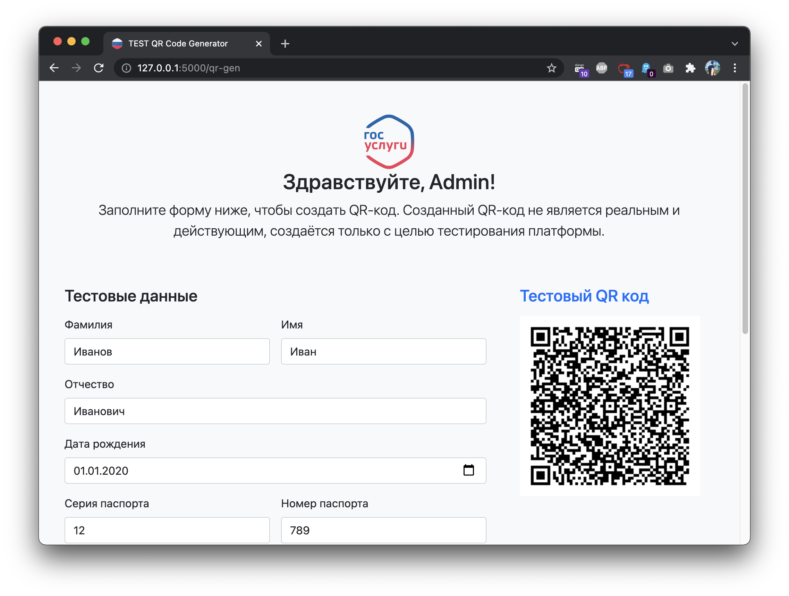

# Генератор тестовых COVID-19 QR-кодов



Генерируемые тестовые QR-коды подходят для проверки только на тестовом стенде. Данное приложение не
генерирует рабочие QR-коды. Созданными QR-кодами пользоваться запрещено!

Сервис поддерживает дополнительно работу Telegram бота — это опционально, не требуется для работы основного демо-стенда.

## Настройка

#### Основные настройки сайта

Для запуска демо-стенда требуются следующие переменные окружения:

- `FLASK_APP` — указывается местоположение скрипта сервера, необходимо указать: `app/main`
- `FLASK_ENV` — устанавливается значение окружения, требуется для работы в среде разработки, указывается `development`,
по умолчанию ставится `production`.
- `FLASK_DEBUG` — для включения отладочного режима необходимо включить, указав `1`.
- `REDIS_URL` — указывается полный адрес подключения к Redis, например: `redis://localhost:6379/0`

#### Основные настройки Telegram бота

Для работы Telegram бота необходимо предварительно зарегистрировать бота в [@BotFather](https://t.me/BotFather).
Процедуру регистрации можно найти на просторах Интернета.

- `TG_BOT_TOKEN` — токен вашего Telegram бота полученный после регистрации.
- `TG_BOT_QR_HOST` — хост вашего сайта на котором работает основной сайт для тестирования кодов. Поддерживаются IDNA домены.
- `REDIS_URL` — указывается полный адрес подключения к Redis, например: `redis://localhost:6379/0`

### Redis

Для хранения временных данных используется Redis. Все временные данные сохраняются на срок от 10 минут до 1 часа.

### Суперпользователи

По умолчанию задан пользователь `admin` с паролем `password`. Для создания собственных пользователей 
необходимо использовать следующие переменные окружения:

- `ADMIN_USERS` — кол-во суперпользователей.
- `USER_<N>_USERNAME` — логин суперпользователя на сайте.
- `USER_<N>_PASSWORD` — пароль суперпользователя на сайте.
- `USER_<N>_FIRST_NAME` — имя суперпользователя, подставляется автоматически в поле «Имя».
- `USER_<N>_LAST_NAME` — фамилия суперпользователя, подставляется автоматически в поле «Фамилия».
- `USER_<N>_SECOND_NAME` — отчество суперпользователя, подставляется автоматически в поле «Отчество».
- `USER_<N>_B_DAY` — день рождения суперпользователя, подставляется автоматически в поле «День рождения».
- `USER_<N>_SERIES` — первые 2 цифры серии паспорта суперпользователя, подставляется автоматически в поле «Серия паспорта».
- `USER_<N>_NUMBER` — последние 3 цифры номера паспорта суперпользователя, подставляется автоматически в поле «Номер паспорта».
- `USER_<N>_TG_CHAT_ID` — ID пользователя Telegram, используется для автоматической авторизации пользователя в Telegram.
- `USER_<N>_TIMEZONE` — [название часового пояса][tz], используется для автоматической генерации даты и времени валидации тестового QR-кода в указанном часовом поясе пользователя.

Где `<N>` — это цифры от 0 до указанного кол-ва суперпользователей в переменной `ADMIN_USERS`, 0 — это 1-ый пользователь.

[tz]: https://en.wikipedia.org/wiki/List_of_tz_database_time_zones#List

## Запуск

Запустить проект можно несколькими способами:

- **[Без использования Docker](#start-without-docker)** — подойдёт для локальной разработки (не рекомендуется).
- **[С частичным использованием Docker](#start-with-part-docker)** — рекомендуемый способ для локальной разработки.
- **[Полностью используя Docker](#start-with-docker)** — подойдёт для запуска в Интернете, для более глубокого тестирования.

<a name="start-without-docker"></a>
### Без использования Docker

Для данного запуска необходимо предварительно позаботиться о предварительно запущенном сервере Redis.

Укажите полный адрес сервера Redis в переменной окружения `REDIS_URL`.

Создайте виртуальное окружение Python 3.9 командой:

```shell
$ python3 -m venv venv
```

Активируйте виртуальное окружение:

```shell
$ source ./venv/bin/active
```

Обновите пакетный менеджер pip до последней версии:

```shell
$ pip insttall --upgrade pip
```

Установите зависимые пакеты:

```shell
$ pip install -r requirements.txt
```

Запустите web-сервер

```shell
$ flask run
```

Для запуска телеграм бота необходимо указать токен вашего бота в переменной `TG_BOT_TOKEN`, после запустить командой:

```shell
$ python app/bot.py
```

<a name="start-with-part-docker"></a>
### С частичным использованием Docker

Этот способ от предыдущего отличается только тем, что Redis можно запустить воспользовавшись Docker. 
Redis с помощью Docker можно запустить 2 способами:

1. С использованием Docker Compose (рекомендуется).
2. Без использования Docker Compose.

Первый вариант делается командой:

```shell
$ docker-compose up redis -d 
```

Второй вариант:

```shell
$ docker run --name redis -d redis -p 6379:6379
```

Далее необходимо выполнить все шаги описанные в предыдущем варианте запуска.

<a name="start-with-docker"></a>
### Полностью используя Docker

Этот способ самый лёгкий для запуска проекта, но требуется заранее установленного Docker и docker-compose.

Для запуска проекта выполните команду:

```shell
$ docker-compose up -d --build
```

## Эксплуатация

### Сайт

Для формирования QR-кода с тестовыми данными перейдите по ссылке: <http://localhost:5000/qr-gen> и авторизуйтесь
под суперпользователем.

Введите тестовые данные и нажмите кнопку «**Создать тестовый QR-код**». Справа появится созданные QR-код с тестовыми
данными. Можно перейти по нему воспользовавшись любым QR сканером.

**ВНИМАНИЕ!** Для тестирования с нескольких устройств необходимо запускать сервис либо на действующем домене, 
либо полностью используя Docker, при этом вместо `localhost` в адресе надо будет указать IP-адрес вашей машины внутри
локальной сети.

### Telegram бот

После запуска соответствующего контейнера (см. инструкцию выше), найдите своего Telegram бота, и нажмите на кнопку 
«Start/Начать» или введите команду `/start`. В ответ вы получите сообщение:

> Username, извиняйте, но вашего ID (<ваш ID в Telegram>) нет в системе.

После этого необходимо добавить этот ID в переменную окружения, для настройки суперпользователя и перезапустить
контейнер с Telegram ботом.

После перезапуска контейнера, снова выполните команду `/start`. Вы должны получить сообщение с данными указанными в 
переменных окружения для суперпользователей с запросом на подтверждение: подтвердите эти данные.

Следующий шаг будет про время валидности QR-кода. Выберите любой из вариантов.

После выбора времени валидности тестового QR-кода вы получите тестовый QR-код с указанием даты и времени до которого 
действителен данный код.
